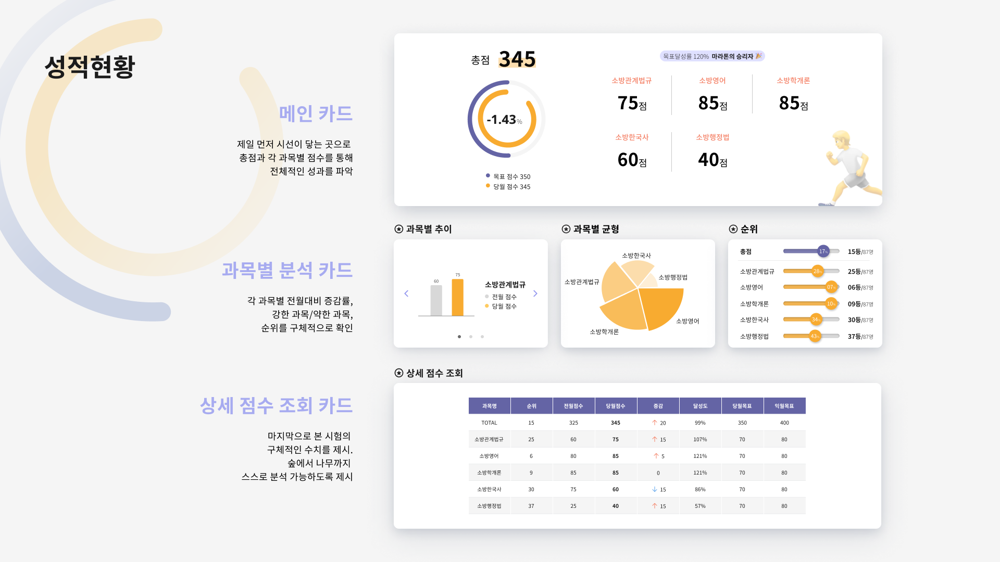
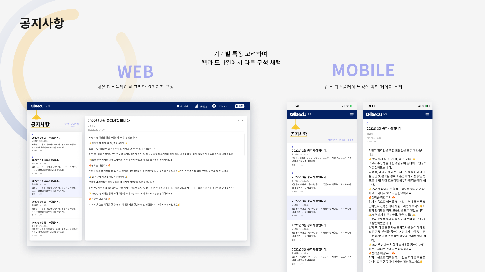
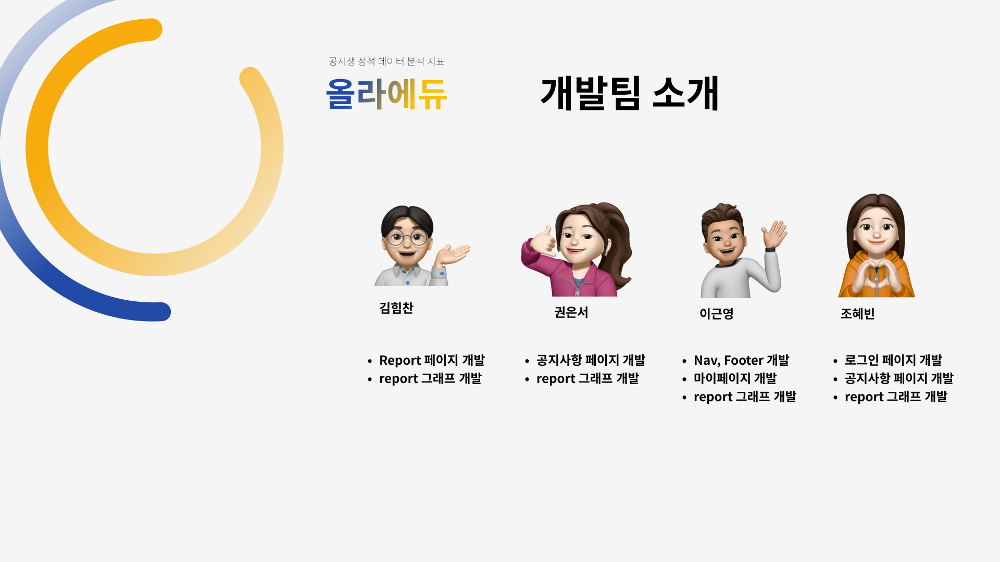

# Project : OllaEdu Sherpa

# 1. Propose
## 프로젝트에 대한 설명
- 데이터 기반 학생 종합 리포트 애플리케이션 개발 프로젝트
- pc, tablet, mobile에서 볼 수 있도록 반응형 작업
- context API로 전역상태관리

## 프로젝트 일정     
- 기획 : 2/11 ~ 2/17
- 1차 디자인 작업 : 2/18 ~ 2/22
- 1차 개발 : 2/23 ~ 3/1
- 디자인 & 개발 병행 : 3/2 ~ 3/10
- 2차 디자인 수정 : 3/11 ~ 3/13
- 최종 개발 : 3/14 ~ 3/17

## 폴더 구조
```
src
 ┣ assets
 ┣ components
 ┣ constructors
 ┣ containers
 ┣ context
 ┣ elements
 ┣ hooks
 ┣ pages
 ┣ App.jsx
 ┣ GlobalStyle.jsx
 ┗ main.jsx
 ```

# 2. Stack
## UX/UI
- Figma
- Adobe Illustrator

## Frontend 
Language | Framework | Library | 상태관리
:--:| :--: | :--: | :--:
JavaScript | React | react-router-dom<br/>d3.js<br>styled-component<br/>Axios<br/>vite (template react) | ContextAPI


# 3. 프로젝트 기능 설명
- 로그인 
  
- 성적 현황
  - 선택한 해당 월의 총점, 과목별 점수 데이터를 d3라이브러리를 사용하여 그래프로 시각화하여 보여줌
  
- 마이 페이지
  - 수강생의 기본정보 및 일정표 확인
  
- 공지사항
  - 학원의 공지사항 확인
  

# 4. 프로젝트 배포
### [OllaEdu](https://ollaedusherpa.web.app/)
```
ID : fastcampus1
PW : 1234

배포 형식 : firebase 
```


# 5. 저작권, 라이선스 정보
Powered by EduHashGlobalPartners


# 6. Team Member
- UX/UI : 이소혜, 이정민, 하상집
- FE : 권은서, 김힘찬, 이근영, 조혜빈
  